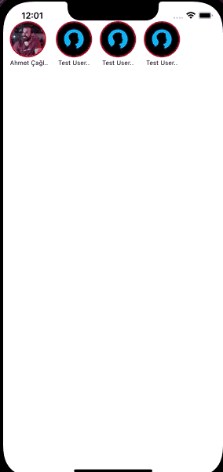

# react-native-insta-story

<p align="center">

</p>

## Install

#### 1. Step
```javascript
npm install react-native-insta-story --save
```
or

```javascript
yarn add react-native-insta-story 
```

#### 2. Step
```javascript
cd ios && pod install
```

## Import
```javascript
import InstaStory from 'react-native-insta-story';
```

## Props
| Name | Description                                         | Type      | Default Value |
| :--- |:----------------------------------------------------|:----------|:-------------:|
| data | Array of IUserStory. You can check from interfaces. | object    |               |
| unPressedBorderColor | Unpressed border color of profile circle            | color     |      red      |
| pressedBorderColor | Pressed border color of profile circle              | color     |     grey      |
| onClose | Todo when close                                     | function  |     null      |
| onStart | Todo when start                                     | function  |     null      |
| duration | Per story duration seconds                          | number    |      10       |
| swipeText | Text of swipe component                             | string    |   Swipe Up    |
| customSwipeUpComponent | For use custom component for swipe area             | component |               |
| customCloseComponent | For use custom component for close button           | component |               |
| avatarSize | Size of avatar circle                               | number    |      60       |
| showAvatarText | For show or hide avatar text.                       | bool      |     true      |
| textStyle | For avatar text style                               | TextStyle      |           |

## Usage
```javascript

const data = [
    {
        user_id: 1,
        user_image: 'https://pbs.twimg.com/profile_images/1222140802475773952/61OmyINj.jpg',
        user_name: "Ahmet Çağlar Durmuş",
        stories: [
            {
                story_id: 1,
                story_image: "https://image.freepik.com/free-vector/universe-mobile-wallpaper-with-planets_79603-600.jpg",
                swipeText:'Custom swipe text for this story',
                onPress: () => console.log('story 1 swiped'),
            },
            {
                story_id: 2,
                story_image: "https://image.freepik.com/free-vector/mobile-wallpaper-with-fluid-shapes_79603-601.jpg",
            }]
    },
    {
        user_id: 2,
        user_image: 'https://images.unsplash.com/photo-1511367461989-f85a21fda167?ixid=MnwxMjA3fDB8MHxzZWFyY2h8Mnx8cHJvZmlsZXxlbnwwfHwwfHw%3D&ixlib=rb-1.2.1&w=1000&q=80',
        user_name: "Test User",
        stories: [
            {
                story_id: 1,
                story_image: "https://encrypted-tbn0.gstatic.com/images?q=tbn:ANd9GcTjORKvjcbMRGYPR3QIs3MofoWkD4wHzRd_eg&usqp=CAU",
                swipeText:'Custom swipe text for this story',
                onPress: () => console.log('story 1 swiped'),
            },
            {
                story_id: 2,
                story_image: "https://files.oyebesmartest.com/uploads/preview/vivo-u20-mobile-wallpaper-full-hd-(1)qm6qyz9v60.jpg",
                swipeText:'Custom swipe text for this story',
                onPress: () => console.log('story 2 swiped'),
            }]
    }];


<InstaStory data={data}
            duration={10}
            onStart={item => console.log(item)}
            onClose={item => console.log('close: ', item)}
            customSwipeUpComponent={<View>
                                <Text>Swipe</Text>
                            </View>}
            style={{marginTop: 30}}/>

```


[](http://www.bynogame.com/tr/destekle/caglardurmus)
